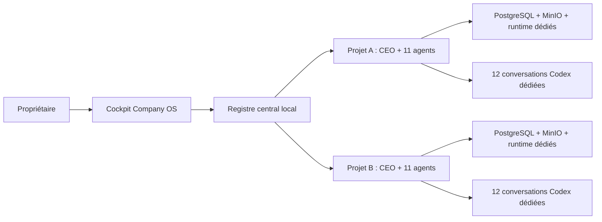
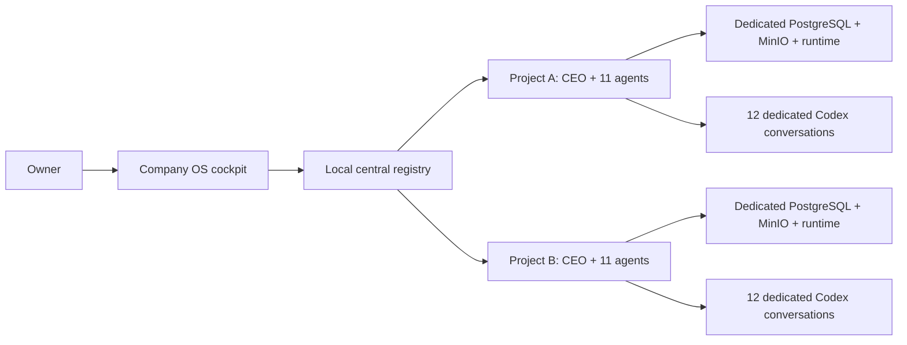

# Company OS

> A local-first control plane for running autonomous, project-isolated AI company teams with human approval gates.

[](#project-status--statut-du-projet)
[](https://nextjs.org/)
[](https://www.typescriptlang.org/)
[](LICENSE.md)

**[Français](#français) · [English](#english)**

Company OS is source-available software. Noncommercial use is permitted under the [PolyForm Noncommercial License 1.0.0](LICENSE.md). Commercial use requires a separate paid license.

---

# Français

## Présentation

Company OS est un cockpit local qui permet de connecter plusieurs projets logiciels et d’attribuer à chacun une équipe autonome composée d’un CEO et de onze spécialistes. Chaque entreprise dispose de ses propres conversations Codex, travaux, décisions, livrables, mémoire, base PostgreSQL, stockage MinIO et runtime.

Le propriétaire choisit quand lancer une séquence autonome, suit les agents en temps réel et conserve le contrôle des actions sensibles. Company OS fonctionne sur la machine locale : il ne doit pas être intégré au build public des produits qu’il pilote.

> **Projet en développement actif.** Utilisez-le sur une machine de développement, sauvegardez vos données et relisez les actions proposées avant de les approuver.

## Pourquoi Company OS ?

Les assistants de code savent accomplir une tâche isolée. Company OS ajoute la couche nécessaire pour piloter une entreprise dans la durée : séparation des projets, responsabilités explicites, conversations persistantes, délégation, validation croisée, livrables et garde-fous humains.

Il ne remplace pas le jugement du propriétaire. Il organise le travail et rend l’activité de l’équipe compréhensible et contrôlable.

## Fonctionnalités

- cockpit central pour enregistrer et ouvrir plusieurs entreprises ;
- un CEO et onze agents spécialisés par projet ;
- conversations Codex persistantes et distinctes pour chaque agent ;
- sessions autonomes déclenchées manuellement par le propriétaire ;
- discussion stratégique entre le CEO et les spécialistes ;
- délégation, vérification croisée et conclusions lisibles ;
- suivi en temps réel des agents actifs, travaux et événements ;
- décisions, livrables et mémoire opérationnelle durables ;
- pause générale et portes d’approbation pour les actions sensibles ;
- configuration locale de fournisseurs et connecteurs avec chiffrement des identifiants ;
- accès propriétaire et opérateur local ;
- isolation par base PostgreSQL, bucket MinIO, port et runtime ;
- démarrage et arrêt de toute la pile avec deux scripts PowerShell ;
- interface responsive en français, pensée pour une personne non technique.
- Studio vidéo local : brief Codex, voix Windows et vrais MP4 verticaux Remotion pour TikTok et Instagram Reels, sans publication automatique.

## Équipe fournie

Chaque projet reçoit douze rôles internes indépendants :

| Agent | Responsabilité principale |
| --- | --- |
| CEO | Analyse la situation, consulte l’équipe, décide et délègue. |
| Produit | Priorités, besoins utilisateurs et feuille de route. |
| Design & conversion | Expérience utilisateur, interface et conversion. |
| Développement full-stack | Architecture et réalisation technique. |
| Qualité & sécurité | Tests, vérification et blocage des livraisons risquées. |
| Croissance | Acquisition, funnel et expérimentation. |
| Contenu & marque | Positionnement, contenus et cohérence éditoriale. |
| Création vidéo courte | Accroches, storyboard, voix, rendu Remotion et livrables TikTok/Reels. |
| Ventes & partenariats | Opportunités commerciales et partenariats. |
| Service client | Retours utilisateurs, support et documentation d’aide. |
| Finance & risques | Budget, viabilité et risques financiers. |
| Fiabilité & confidentialité | Exploitation, incidents, données et confidentialité. |

Les étapes techniques d’un produit ne sont pas présentées comme des agents. Ces douze rôles constituent l’équipe interne chargée de construire et d’exploiter le projet connecté.

## Architecture



Le cockpit central écoute par défaut sur `127.0.0.1:3020`. PostgreSQL et MinIO sont exposés uniquement sur la boucle locale. Chaque projet reçoit un port entre `3200` et `3399`, une base, un bucket, un runtime et douze identifiants de conversations distincts.

Consultez [l’architecture détaillée](docs/architecture.md) pour les frontières de sécurité et le fonctionnement des processus.

## Prérequis

- Windows 10 ou Windows 11 ;
- PowerShell 5.1 ou supérieur ;
- [Node.js](https://nodejs.org/) 22 ou supérieur ;
- [Docker Desktop](https://www.docker.com/products/docker-desktop/) démarré ;
- Codex installé et connecté dans la session Windows courante ;
- Git.

## Installation locale

```powershell
git clone https://github.com/alex97451/company-os.git
Set-Location company-os
npm install
npm run ops:setup
```

`ops:setup` crée un fichier `.env.local` ignoré par Git, génère les identifiants locaux nécessaires et prépare le runtime Codex. Ne copiez jamais les valeurs de ce fichier dans un commit, une issue ou une capture d’écran.

Vérifiez ensuite que Docker Desktop est démarré, puis lancez toute la pile :

```powershell
.\run-local.ps1
```

Ouvrez [http://localhost:3020/ops](http://localhost:3020/ops).

Pour arrêter tous les processus Company OS sans supprimer les volumes et les données :

```powershell
.\stop-local.ps1
```

## Connecter un projet

1. Ouvrez **Système → Projets connectés**.
2. Indiquez un identifiant, un nom, un type et le chemin absolu du dépôt.
3. Lancez l’initialisation.
4. Attendez que la carte indique que le projet est prêt.
5. Cliquez sur **Ouvrir son cockpit**.

L’initialisation est idempotente. Elle ajoute uniquement les fichiers `.company-os` absents, crée les ressources isolées, provisionne les douze conversations Codex et démarre le cockpit du projet. Elle ne remplace pas les fichiers existants et ne déclenche aucune campagne, dépense ou action externe.

Exemple de racine autorisée dans `.env.local` :

```dotenv
COMPANY_PROJECTS_ALLOWED_ROOTS=C:\Projects
COMPANY_PROJECTS_FORBIDDEN_ROOTS=C:\Projects\sensitive-project
```

Séparez plusieurs racines Windows avec un point-virgule.

## Configuration

Les noms de variables disponibles sont documentés dans [.env.example](.env.example). Les valeurs réelles doivent rester dans `.env.local`.

Configuration sûre par défaut :

```dotenv
OPS_LOCAL_ONLY=true
OPS_LAN_ENABLED=false
OPS_CODEX_MODE=app-server-stdio
GLOBAL_EXTERNAL_WORK_ENABLED=false
META_ADS_ENABLED=false
META_DAILY_BUDGET_CAP=0
```

Les fournisseurs externes, OAuth et clés API ne sont jamais requis pour démarrer le cockpit local. Leur configuration éventuelle est décrite dans [docs/provider-setup.md](docs/provider-setup.md). Les actions externes restent soumises aux approbations du propriétaire.

## Sécurité et confidentialité

- Company OS est local uniquement et ne doit pas être publié comme service Internet.
- Aucun secret ne doit être versionné, journalisé ou placé dans la mémoire des agents.
- Les identifiants de conversations, journaux et livrables locaux restent dans `work/`, ignoré par Git.
- Les fichiers `.env.local`, `.next/`, `node_modules/`, données et sorties locales sont ignorés.
- Les actions financières, publicitaires, contractuelles, de production ou de communication inhabituelle nécessitent une approbation explicite.
- L’accès LAN est désactivé par défaut. Ne redirigez jamais le port depuis un routeur et n’utilisez pas de tunnel public.
- Company OS ne tue pas un processus qu’il ne peut pas identifier comme lui appartenant.

Ce projet fournit des garde-fous techniques, pas une garantie de sécurité absolue. Vérifiez la configuration, les dépendances et les permissions avant toute utilisation sensible.

## Développement

Le cockpit central fonctionne en développement avec rechargement automatique :

```powershell
npm run dev
```

Commandes principales :

| Commande | Usage |
| --- | --- |
| `npm run ops:setup` | Prépare la configuration locale. |
| `npm run ops:rotate-owner` | Renouvelle les identifiants propriétaire locaux. |
| `npm run ops:migrate` | Applique les migrations PostgreSQL. |
| `npm run verify` | Lance lint, types, tests et build. |
| `npm run test:e2e` | Vérifie le cockpit avec Playwright. |
| `.\run-local.ps1` | Démarre l’infrastructure et tous les runtimes. |
| `.\stop-local.ps1` | Arrête la pile sans effacer les données. |

Toute modification destinée à une version doit réussir :

```powershell
npm run lint
npm run typecheck
npm run test
npm run build
```

Les changements d’interface doivent également être vérifiés aux largeurs `375`, `768`, `1024` et `1440` pixels.

## Structure du dépôt

```text
company/       Manifestes, rôles, règles et playbooks des agents
docs/          Architecture, exploitation et configuration
migrations/    Schéma PostgreSQL du cockpit
scripts/       Installation, démarrage, arrêt et runtimes projets
src/app/       Interface et API locales Next.js
src/components Composants du cockpit
src/lib/       Authentification, agents, orchestration et connecteurs
tests/         Tests unitaires et d’intégration
e2e/           Vérifications Playwright responsive
```

## Dépannage

- **Cockpit inaccessible** : démarrez Docker Desktop puis relancez `.\run-local.ps1`.
- **Codex hors ligne** : vérifiez que Codex est connecté dans la même session Windows.
- **Projet en erreur** : consultez la carte du projet et l’onglet Santé, corrigez la cause puis redémarrez uniquement ce projet.
- **Port occupé** : arrêtez le programme concerné ou modifiez l’attribution ; Company OS ne doit jamais arrêter un service étranger.
- **Connexion refusée après une rotation** : déconnectez-vous puis reconnectez-vous avec les nouveaux identifiants locaux.

Le [guide d’exploitation locale](docs/local-runbook.md) contient les procédures détaillées.

## Contribuer

Les issues et pull requests sont bienvenues pour les usages autorisés par la licence.

1. Créez une branche dédiée.
2. Gardez les changements limités à Company OS.
3. N’ajoutez aucun secret, contenu client ou donnée privée.
4. Ajoutez ou adaptez les tests.
5. Exécutez `npm run verify` avant la pull request.
6. Expliquez le comportement réel, les limites et les risques de votre changement.

Une contribution n’accorde pas automatiquement un droit d’utilisation commerciale du projet complet. Consultez [LICENSE.md](LICENSE.md).

## Licence et usage commercial

Copyright © 2026 `alex97451`.

Ce dépôt est distribué sous la [PolyForm Noncommercial License 1.0.0](LICENSE.md). Vous pouvez l’étudier, le modifier et le partager pour les usages non commerciaux autorisés par cette licence.

Toute utilisation principalement destinée à un avantage commercial ou à une rémunération privée nécessite une **licence commerciale payante séparée**. Pour demander une licence commerciale, contactez le propriétaire depuis son [profil GitHub](https://github.com/alex97451). Les conditions et le tarif sont établis séparément par écrit.

Cette section est un résumé pratique et ne remplace pas le texte de la licence. En cas de différence, [LICENSE.md](LICENSE.md) prévaut.

Le moteur vidéo utilise Remotion, qui possède sa propre licence et ses propres conditions. Vérifiez les [conditions Remotion](https://www.remotion.dev/license) avant tout usage commercial, en équipe ou comme outil d’automatisation. Company OS n’achète aucune licence et n’active aucun service Remotion payant.

---

# English

## Overview

Company OS is a local control plane for connecting multiple software projects and assigning each one an autonomous internal team made of one CEO and eleven specialists. Every company gets separate Codex conversations, work items, decisions, deliverables, memory, PostgreSQL database, MinIO storage and runtime.

The owner decides when to start an autonomous sequence, watches agents work in real time and keeps control of sensitive actions. Company OS runs on the local machine and must never be bundled into the public build of a managed product.

> **This project is under active development.** Run it on a development machine, back up your data and review proposed actions before approving them.

## Why Company OS?

Coding assistants can complete isolated tasks. Company OS adds the operating layer required to manage a company over time: project boundaries, explicit ownership, persistent conversations, delegation, peer verification, deliverables and human approval gates.

It does not replace owner judgment. It organizes the work and makes the internal team’s activity understandable and controllable.

## Features

- central cockpit for registering and opening multiple companies;
- one CEO and eleven specialist agents per project;
- persistent, project-specific Codex conversations for every agent;
- autonomous sessions started manually by the owner;
- strategy discussions between the CEO and specialists;
- delegation, peer verification and plain-language conclusions;
- real-time visibility into active agents, work and events;
- durable decisions, deliverables and operational memory;
- global pause and approval gates for sensitive actions;
- local provider and connector setup with encrypted credentials;
- separate owner and local operator access;
- isolation by PostgreSQL database, MinIO bucket, port and runtime;
- one-command startup and shutdown for the complete local stack;
- responsive French interface designed for non-technical operators.
- local Video Studio with Codex briefs, Windows voice synthesis and real Remotion MP4 renders for TikTok and Instagram Reels, with no automatic publishing.

## Included team

Every connected project receives eleven independent internal roles:

| Agent | Primary responsibility |
| --- | --- |
| CEO | Reviews the company, consults the team, decides and delegates. |
| Product | User needs, priorities and roadmap. |
| Design & conversion | User experience, interface and conversion. |
| Full-stack engineering | Architecture and technical implementation. |
| Quality & safety | Testing, verification and release blocking. |
| Growth | Acquisition, funnel analysis and experiments. |
| Content & brand | Positioning, content and editorial consistency. |
| Short-form video | Hooks, storyboard, voice, Remotion rendering and TikTok/Reels deliverables. |
| Sales & partnerships | Commercial opportunities and partnerships. |
| Customer care | User feedback, support and help content. |
| Finance & risk | Budget, viability and financial risk. |
| Reliability & privacy | Operations, incidents, data and privacy. |

Product pipeline stages are not presented as agents. These twelve roles are the internal team responsible for building and operating the connected project.

## Architecture



The central cockpit listens on `127.0.0.1:3020` by default. PostgreSQL and MinIO are bound to loopback. Each project receives a port between `3200` and `3399`, a database, a bucket, a runtime and eleven distinct conversation identifiers.

Read the [architecture documentation](docs/architecture.md) for security boundaries and process details.

## Requirements

- Windows 10 or Windows 11;
- PowerShell 5.1 or later;
- [Node.js](https://nodejs.org/) 22 or later;
- [Docker Desktop](https://www.docker.com/products/docker-desktop/) running;
- Codex installed and signed in under the current Windows session;
- Git.

## Local installation

```powershell
git clone https://github.com/alex97451/company-os.git
Set-Location company-os
npm install
npm run ops:setup
```

`ops:setup` creates a Git-ignored `.env.local`, generates the required local credentials and prepares the Codex runtime. Never copy values from this file into commits, issues or screenshots.

Start Docker Desktop, then launch the complete stack:

```powershell
.\run-local.ps1
```

Open [http://localhost:3020/ops](http://localhost:3020/ops).

Stop every Company OS process without deleting volumes or data:

```powershell
.\stop-local.ps1
```

## Connect a project

1. Open **System → Connected projects**.
2. Enter an identifier, a name, a type and the repository’s absolute path.
3. Start initialization.
4. Wait until the project card reports that it is ready.
5. Select **Open cockpit**.

Initialization is idempotent. It only adds missing `.company-os` files, creates isolated resources, provisions eleven Codex conversations and starts the project cockpit. It does not overwrite existing files or trigger campaigns, spending or external actions.

Example allowed root configuration in `.env.local`:

```dotenv
COMPANY_PROJECTS_ALLOWED_ROOTS=C:\Projects
COMPANY_PROJECTS_FORBIDDEN_ROOTS=C:\Projects\sensitive-project
```

Separate multiple Windows roots with semicolons.

## Configuration

Available configuration names are documented in [.env.example](.env.example). Real values must remain in `.env.local`.

Safe defaults:

```dotenv
OPS_LOCAL_ONLY=true
OPS_LAN_ENABLED=false
OPS_CODEX_MODE=app-server-stdio
GLOBAL_EXTERNAL_WORK_ENABLED=false
META_ADS_ENABLED=false
META_DAILY_BUDGET_CAP=0
```

External providers, OAuth credentials and API keys are not required to start the local cockpit. Optional setup is documented in [docs/provider-setup.md](docs/provider-setup.md). External actions remain subject to owner approval.

## Security and privacy

- Company OS is local-only and must not be exposed as an Internet service.
- Secrets must never be committed, logged or added to agent memory.
- Conversation identifiers, logs and local deliverables stay in the Git-ignored `work/` directory.
- `.env.local`, `.next/`, `node_modules/`, data and local output are ignored.
- Financial, advertising, contractual, production and unusual outbound actions require explicit approval.
- LAN access is disabled by default. Never forward its port from a router or use a public tunnel.
- Company OS never stops a process it cannot verify as one of its own.

These controls reduce risk but do not guarantee absolute security. Review configuration, dependencies and permissions before sensitive use.

## Development

Run the central cockpit with hot reload:

```powershell
npm run dev
```

Main commands:

| Command | Purpose |
| --- | --- |
| `npm run ops:setup` | Prepare local configuration. |
| `npm run ops:rotate-owner` | Rotate local owner credentials. |
| `npm run ops:migrate` | Apply PostgreSQL migrations. |
| `npm run verify` | Run lint, types, tests and build. |
| `npm run test:e2e` | Verify the cockpit with Playwright. |
| `.\run-local.ps1` | Start infrastructure and all runtimes. |
| `.\stop-local.ps1` | Stop the stack without deleting data. |

Every release-oriented change must pass:

```powershell
npm run lint
npm run typecheck
npm run test
npm run build
```

UI changes must also be checked at `375`, `768`, `1024` and `1440` pixels.

## Repository structure

```text
company/       Agent manifests, roles, policies and playbooks
docs/          Architecture, operations and provider setup
migrations/    Cockpit PostgreSQL schema
scripts/       Setup, startup, shutdown and project runtimes
src/app/       Local Next.js UI and APIs
src/components Cockpit components
src/lib/       Authentication, agents, orchestration and connectors
tests/         Unit and integration tests
e2e/           Responsive Playwright checks
```

## Troubleshooting

- **Cockpit unavailable:** start Docker Desktop and rerun `.\run-local.ps1`.
- **Codex offline:** confirm that Codex is signed in under the same Windows session.
- **Project error:** read the project card and Health tab, fix the cause, then restart that project only.
- **Port already in use:** stop the conflicting program or change the allocation; Company OS must never stop an unrelated service.
- **Login rejected after rotation:** sign out and sign in again with the new local credentials.

See the [local operations guide](docs/local-runbook.md) for detailed procedures.

## Contributing

Issues and pull requests are welcome for uses permitted by the license.

1. Create a focused branch.
2. Keep changes scoped to Company OS.
3. Never add secrets, customer content or private data.
4. Add or update tests.
5. Run `npm run verify` before opening a pull request.
6. Document the real behavior, limitations and risks of the change.

A contribution does not automatically grant commercial rights to the complete project. Read [LICENSE.md](LICENSE.md).

## License and commercial use

Copyright © 2026 `alex97451`.

This repository is licensed under the [PolyForm Noncommercial License 1.0.0](LICENSE.md). You may study, modify and share it for the noncommercial purposes permitted by that license.

Any use primarily intended for commercial advantage or private monetary compensation requires a **separate paid commercial license**. To request commercial terms, contact the repository owner through their [GitHub profile](https://github.com/alex97451). Terms and pricing are agreed separately in writing.

This section is a practical summary and does not replace the license text. If they differ, [LICENSE.md](LICENSE.md) controls.

The video engine uses Remotion, which has its own license and terms. Review the [Remotion license](https://www.remotion.dev/license) before commercial, team or automation use. Company OS does not purchase a license or enable any paid Remotion service.

---

## Project status / Statut du projet

Company OS currently targets local Windows development. It has automated linting, strict TypeScript checks, unit and integration tests, production builds and responsive Playwright coverage. Real-world use still requires careful supervision, backups and security review.

Company OS cible actuellement un usage local sous Windows. Le dépôt comprend le lint, TypeScript strict, des tests unitaires et d’intégration, un build de production et des contrôles Playwright responsive. Toute utilisation réelle demande encore une supervision attentive, des sauvegardes et une revue de sécurité.
